Neuron 钱包是 Nervos 基金会开发的 CKB 钱包，它可以保存你的私钥，并代表你创建并广播交易。目前 Neuron 钱包会默认在本地运行一个 CKB 全节点，并且已配置为连接 CKB 主网。安装完成后，当你打开 Neuron 钱包时，本地全节点便会开始同步数据。

你也可以自己 [运行一个主网全节点](mainnet_zh.md)，然后启动 Neuron 钱包，这样 Neuron 就不会启动默认的本地全节点，而是直接连接你的节点。

本教程将分为以下多个小节，每个小节都会有对应详细教程：

- 下载安装 Neuron 钱包
- 等待数据同步完成
- 创建一个新的钱包或将你的 keystore 文件或助记词导入 Neuron 钱包
- 申领被锁定的代币
- 存入 Nervos DAO
- 从 Nervos DAO 提取代币
- 将 CKBytes 从 Neuron 钱包转移到其他钱包和交易所

---

注意： `资产账户` 功能目前处于实验状况，目前只能在 Aggron 测试网使用。

-  管理 `资产账户`

如果在操作本教程的过程中遇到异常，请加入 [discord 频道](https://discord.gg/n6tx7uC) 咨询讨论。

**重要提醒：Nervos 团队绝不会主动要求你提供私钥、keystore 文件、助记词以及钱包密码。你切勿与任何人共享此信息，否则可能会导致丢失所有代币。**

* * *

## 1. 下载安装 Neuron 钱包

从 [Github](https://github.com/nervosnetwork/neuron/releases) 的 [Neuron 钱包发行页面](https://github.com/nervosnetwork/neuron/releases)下载 Neuron 钱包的最新发行版并进行安装。**请确保该版本为最新版本。**导入先前由 Neuron 钱包生成的 keystore 文件或助记词（下面有完整指南），等待数据同步完成，然后你就可以看到钱包的余额已更改。

## 2. 等待数据同步完成
你可以通过匹对 CKB 浏览器上的最新区块数来验证数据同步是否完成。


## 3. 创建一个新的钱包或将你的 keystore 文件或助记词导入 Neuron 钱包

如果你使用的是新钱包，则只需按照 Neuron 钱包中的步骤操作。

如果你已经备份了钱包并拥有 keystore 文件（使用`备份当前钱包`）或已经记下助记词，则需要导入现有的 keystore 文件或助记词，请按照以下步骤操作。

* 备份当前钱包: 

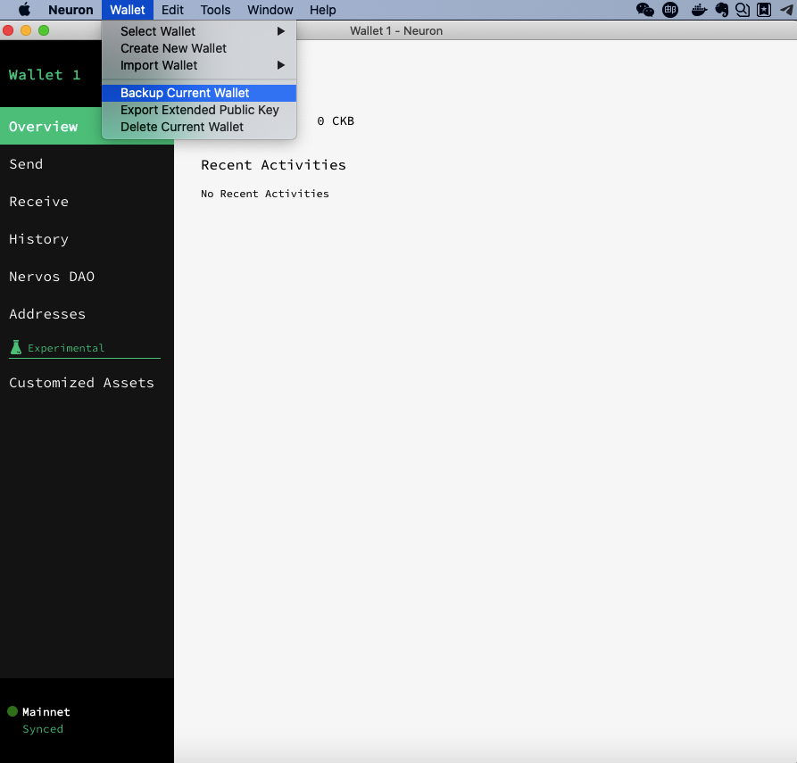

- 若是要导入助记词，则选择 “导入钱包 > 导入助记词”，然后填写密码等待同步即可。密码不需要跟此前的钱包密码一致。

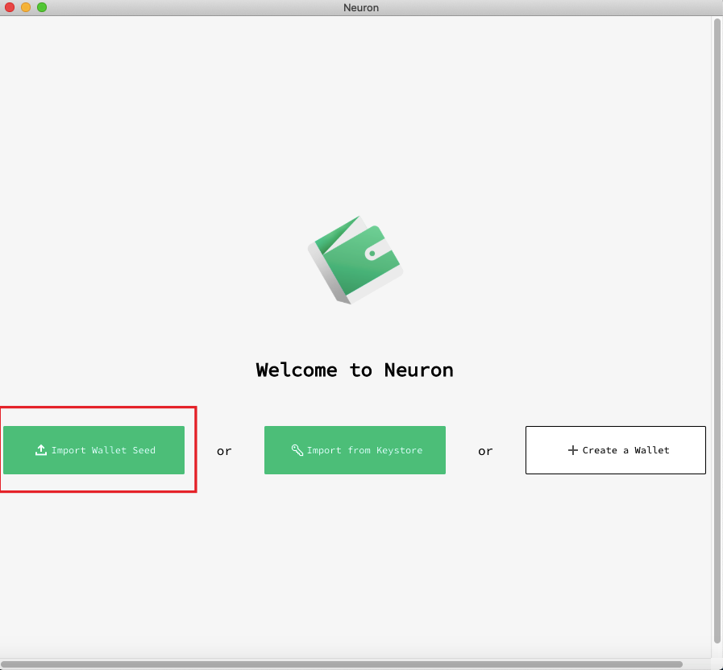

  - 若是要导入 keystore 文件，则选择 “导入钱包 > 导入 keystore 文件”，然后等待同步即可。这里的密码需要跟此前设置的密码一致。

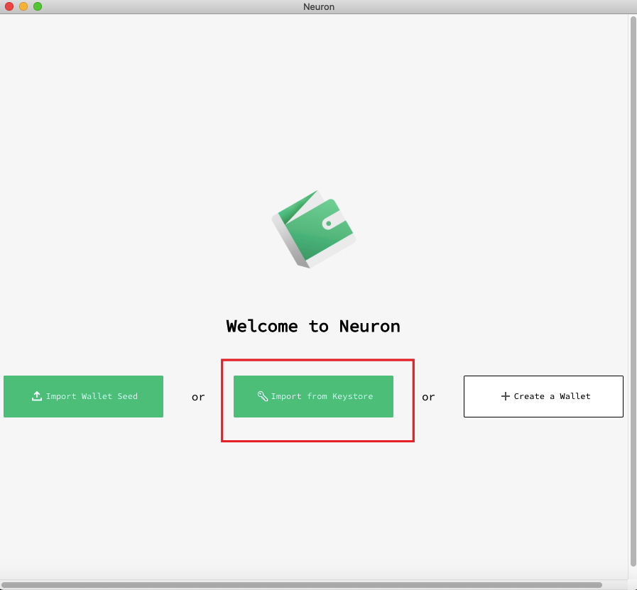

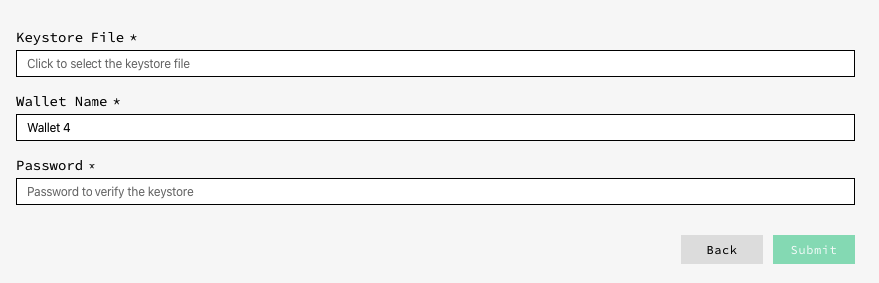

只要 Neuron 钱包同步完成，你就可以进行操作了。你可以发送接收 CKBytes，或者存 CKBytes 到 Nervos DAO 中。

## 4. 申领被锁定的代币

你可以使用最新版本（或更高版本）申领被锁定的代币。不过在此之前，请耐心等待 Neuron 同步，同步完成后，在 “自定义资产” 页面会自动显示账户的资产，在你进行转账或者存款到 Nervos DAO 前，你必须手动申领资产。

* 在 “自定义资产” 页查看详情

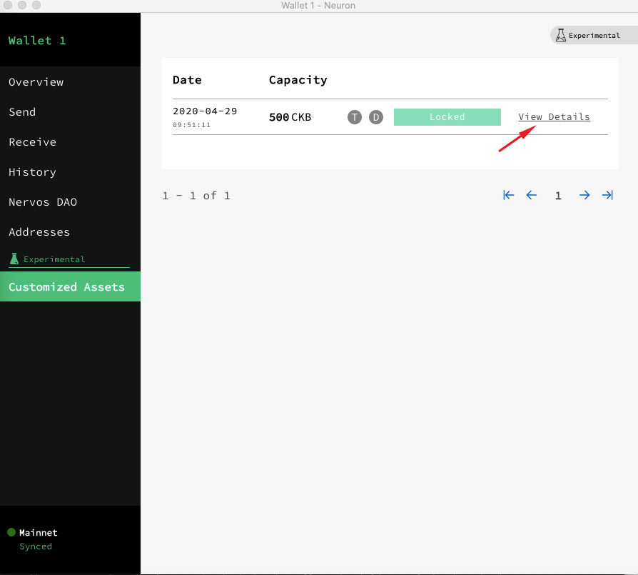

* 申领被锁定的代币

达到锁定时间后，单击申领并输入钱包密码。

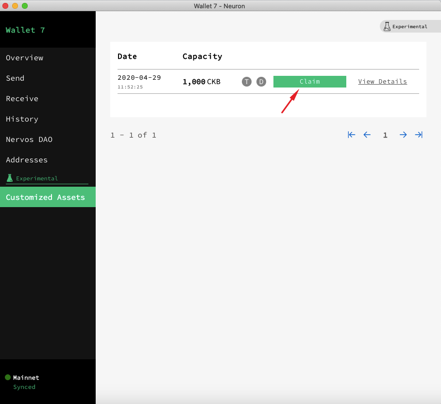


## 5. 将 CKBytes 存入 Nervos DAO

Nervos CKB 的[经济模型](https://github.com/nervosnetwork/rfcs/blob/master/rfcs/0015-ckb-cryptoeconomics/0015-ckb-cryptoeconomics.md) 可以让代币持有者将代币锁定在Nervos DAO中，以减轻二级发行的通胀效应。在这种情况下，二级发行的通货胀效就只是名义上的通胀，持有者等同于持有总量恒定的代币。更多有关详细信息，请参考《[Nervos DAO解释](https://medium.com/nervosnetwork/nervos-dao-explained-95e33898b1c)》。

请确保你的余额大于 102 CKB。

- 打开Neuron 钱包（最新版本），选择 “Nervos DAO” 和 “存入”。

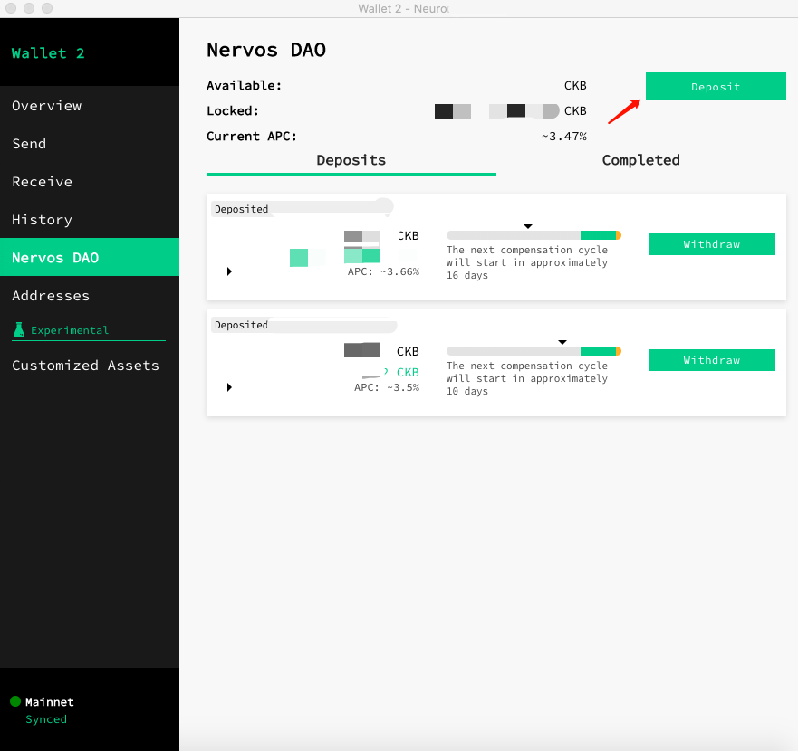

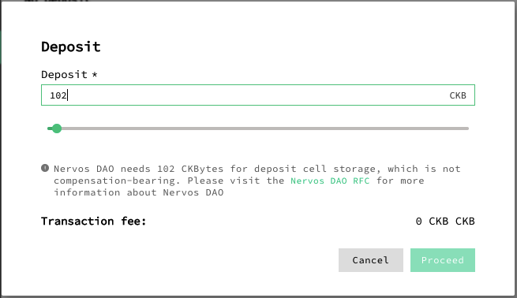

## 6. 从 Nervos DAO 提取代币

> 在主网上进行交易之前，请阅读以下[免责声明](https://docs.nervos.org/references/neuron-wallet-guide#disclaimer)

你可以点击 “取回” 按钮取回你的代币。

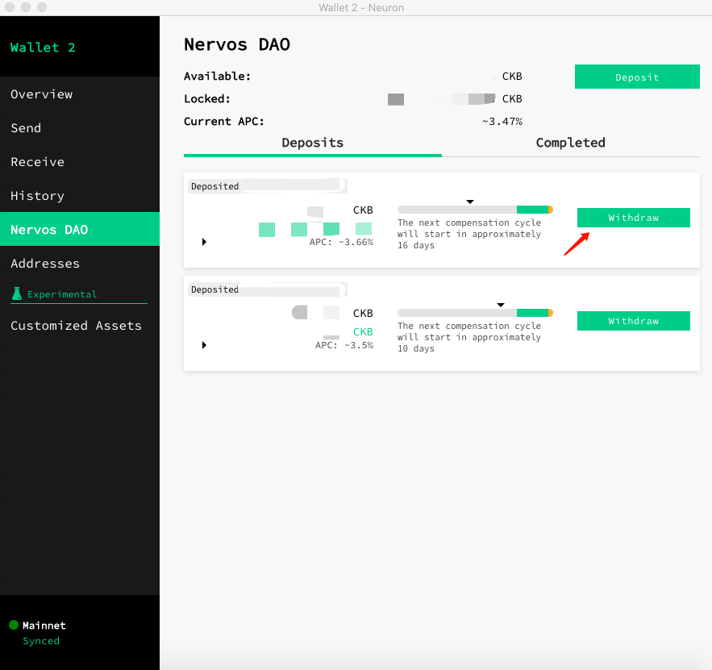

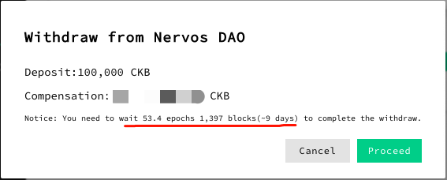

## 7. 将 CKBytes 从 Neuron 钱包转移到其他钱包和交易所

> 在主网上进行交易之前，请阅读以下[免责声明](https://docs.nervos.org/references/neuron-wallet-guide#disclaimer)

你需要拥有第三方钱包/交易所地址，同时请确保你的账户余额大于 62 CKB。

- 点击 “转账” ，填写相关转账信息，可以打开高级设置开关自定义交易费用，点击发送，交易完成。

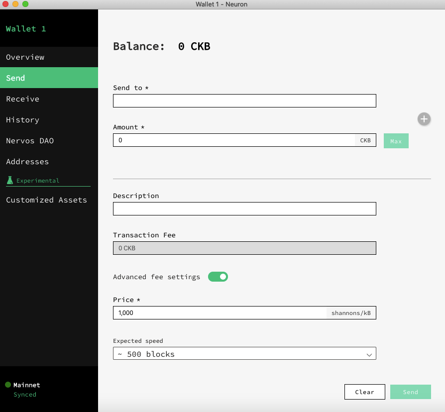

## 8. 管理 `资产账户`

`资产账户` 用于管理如 anyone-can-pay( [RFC: anyone-can-pay lock](https://talk.nervos.org/t/rfc-anyone-can-pay-lock/4438)) cells 和 SUDTs ( [RFC: Simple UDT Draft Spec](https://talk.nervos.org/t/rfc-simple-udt-draft-spec/4333)) 等这类型的账户。推荐使用  `ckb-udt-cli` 来发行或者发送 UDTs，你可以参考 [github 代码库](https://github.com/ququzone/ckb-udt-cli) 了解更多信息。请注意，该功能目前处于实验阶段，仅可在 Aggron 测试网使用。

### 管理 SUDT 账户
#### 事前准备

* Run a CKB Testnet Node 运行 CKB 测试网节点，可以参考  [运行 CKB 测试网节点教程](testnet_zh.md)。
* 
* 使用 `ckb-cli` 创建一个新账户，然后带`lock_arg` 参数导出私钥。

```
ckb-cli account new
```
<details>
<summary>(点击此处查看相应)</summary>
```bash
Your new account is locked with a password. Please give a password. Do not forget this password.
Password: 
Repeat password: 
address:
  mainnet: ckb1qyqwuea9tpxr2equ75rskyn30r3wjans7fnq477mmm
  testnet: ckt1qyqwuea9tpxr2equ75rskyn30r3wjans7fnqgmqyh8
lock_arg: 0xee67a5584c35641cf5070b127178e2e97670f266
lock_hash: 0x8b2595bb1c4720951a5363fbf0adb0ab1e2ff5acd7391f123837242712fc8490

```
</details>

```
ckb-cli account export --extended-privkey-path wallet --lock-arg `Your lock_arg`
```
<details>
<summary>(点击此处查看相应)</summary>
​```bash
./ckb-cli account export --extended-privkey-path wallet --lock-arg 0xee67a5584c35641cf5070b127178e2e97670f266
Password: 
Success exported account as extended privkey to: "wallet", please use this file carefully

```
</details>

```
cat wallet 
```
结果的第一行是导出的私钥。
<details>

<summary>(点击此处查看相应)</summary>
```bash
0a348a7cd1449ece26f1cede3916266793ce18beb280b75dda690057ebfcda3c  // It is the privkey
c152037977043a11e7e6ef220ba050da12da16455a0ef303907865a15fa9c484% 

```
</details>

* 使用`ckb-udt-cli`发行 UDT

请先 clone 并编译，然后使用 [Nervos Aggron 水龙头](https://faucet.nervos.org/) 申领测试网的 CKB 代币。

```
git clone https://github.com/ququzone/ckb-udt-cli.git

cd ckb-udt-cli

export GOPROXY=https://goproxy.io
go mod download
go build .
```
发行 UDTs，请备份 `uuid`。

```
ckb-udt-cli issue -c config.yaml -k YOUR_PRIVATE_KEY -a AMOUNT // AMOUNT means the number of issued tokens
```
<details>
<summary>(点击此处查看相应)</summary>
```bash
./ckb-udt-cli issue -c config.yaml -k 0a348a7cd1449ece26f1cede3916266793ce18beb280b75dda690057ebfcda3c -a 1000000
Issued sUDT transaction hash: 0x6b4458143b25e8aa37d36c1035f15e63e5051144685a4da20cf92fd7af59e56e, uuid: 0x8b2595bb1c4720951a5363fbf0adb0ab1e2ff5acd7391f123837242712fc8490

```
</details>

#### 将 SUDT 账户添加到 Neuron 钱包的  `资产账户`中 

* 在 Neuron 钱包中打开 `资产账户`，创建 SUDT 账户。.

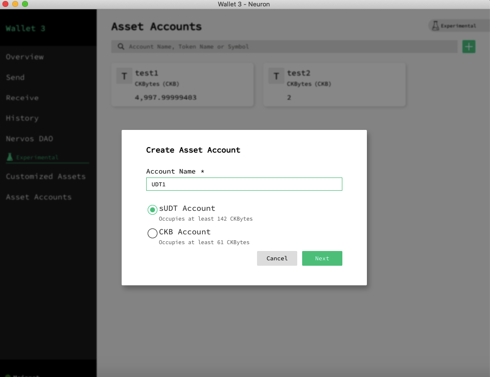

你需要在`代币ID` 栏填写 `uuid`。

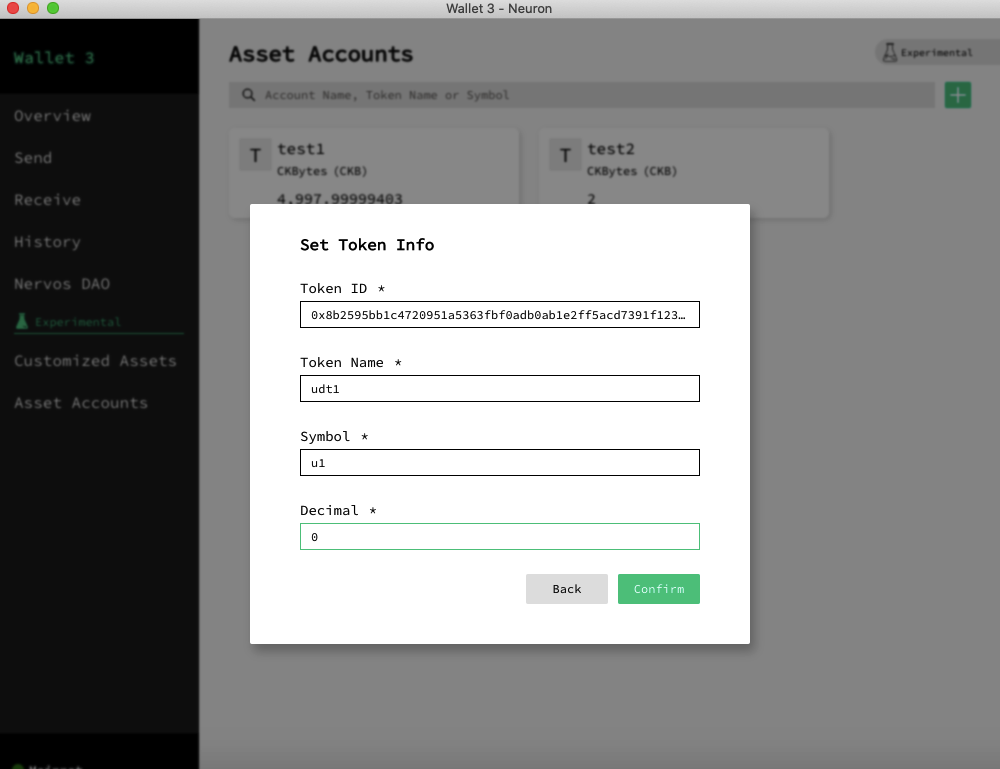

请等待交易成功完成！

### 管理 CKB 账户
`CKB 账户` 可用于 anyone-can-pay cells，并且可以接收`CKB 账户` 间任何数额的付款。 

* 创建两个 `CKB 账户` "Anyone-can-pay1" and "Anyone-can-pay2"

   以下的截屏为创建 "Anyone-can-pay1" 账户的示例。

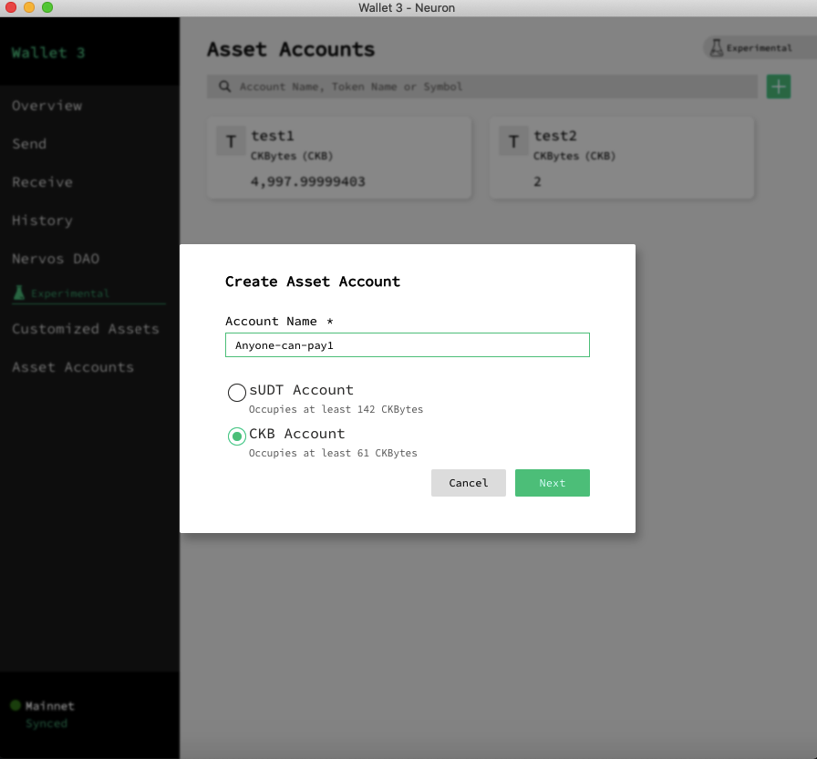

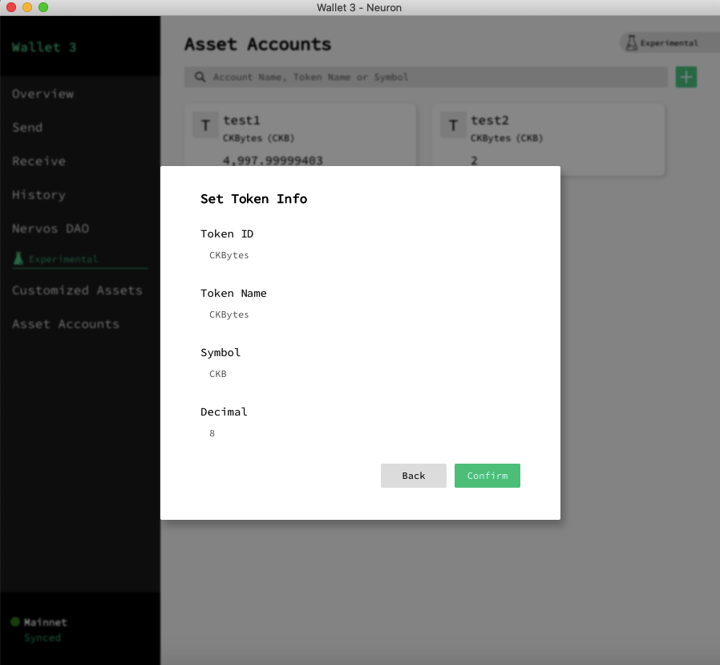

*  从 [Nervos Aggron 测试网](https://faucet.nervos.org/) "Anyone-can-pay1" 账户申领测试网 CKB 代币。
    
    复制 "Anyone-can-pay1" 账户的地址然后填写到 [Nervos Aggron 测试网](https://faucet.nervos.org/).

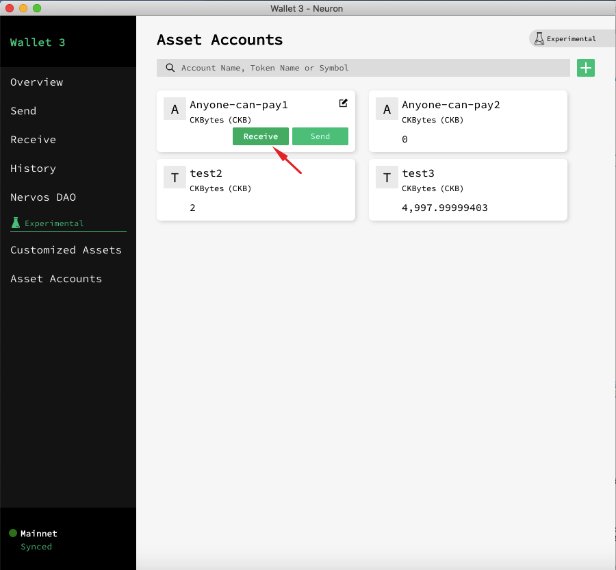

* 从 "Anyone-can-pay1" 账户转 1 CKB 给  "Anyone-can-pay2" 账户。

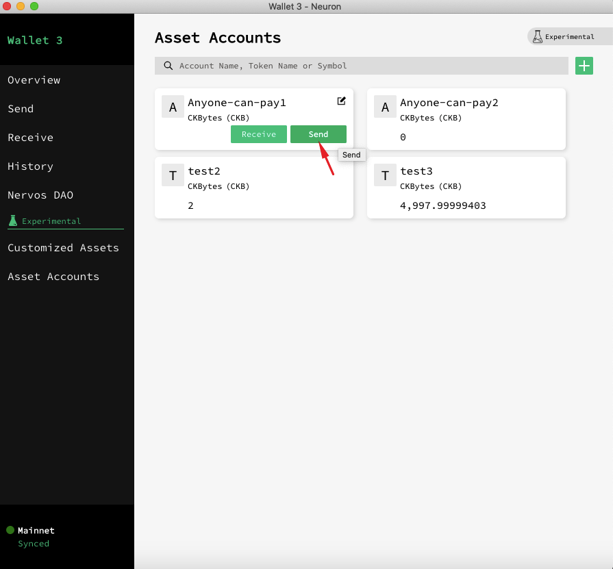

   填写 "Anyone-can-pay2" 账户地址。

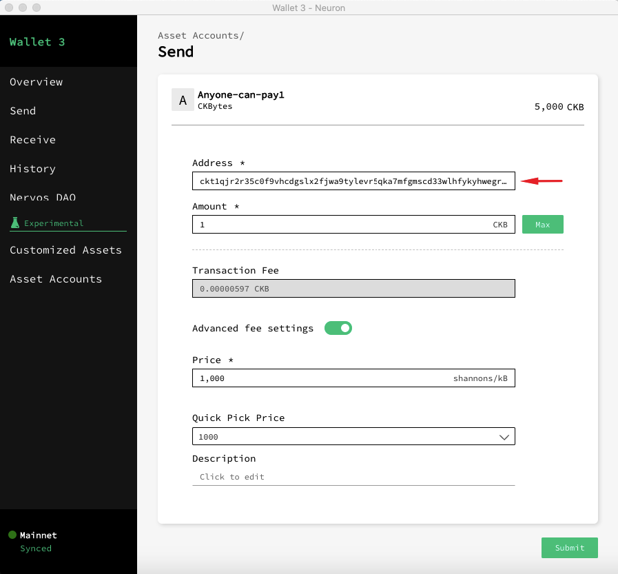
  
   转账完成！

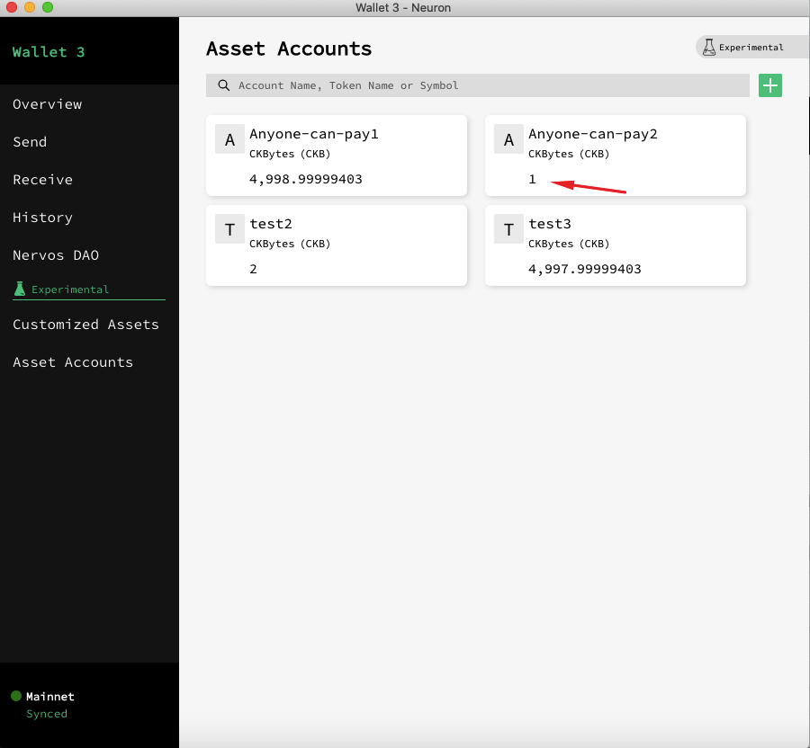

## 疑难解答

### 同步失败，请检查网络。/ 同步很慢.

1. 退出重启钱包试试。

注意:  Neuron 钱包本地自带的 CKB 节点需要在 Windows 上具备 [VC++ redistributable 部件](https://support.microsoft.com/en-us/help/2977003/the-latest-supported-visual-c-downloads) 才能正常运作。

2. 如果步骤 1 无法解决，请自行 [运行 CKB 主网节点](/getting-started/run-node) ，同时确保版本为  v0.32.0 或更高版本，不再使用 Neuron 钱包自带的节点。

3. 如果依旧不生效，请加入 [discord 频道](https://discord.gg/n6tx7uC)，导出 debug 信息并发送到频道中请求帮助。

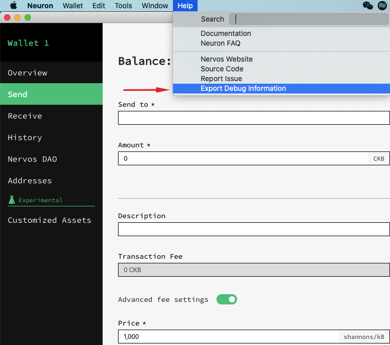

## 重要提示

工作量证明（PoW）区块链网络起初的冷启动难度是很大的。新的 PoW 链就像是一个新生儿，在刚开始的时候是非常虚弱的，但未来成熟茁壮成长了，将潜力无限。
 
对于一条新的 PoW 链，风险主要来源于：

1. **不稳定的哈希率：**主网启动后，随着算力的不断增加，挖矿奖励会剧烈波动。在头几周网络可能会产生分叉和叔块。因为 NC-MAX 共识算法的自身调整，区块时间可能会长于预期。 **处于安全起见，在准备 CKBytes 汇款之前，建议采用足够长的区块确认数。**
2. **未成熟的工具链：** CKB 技术的先行开发者应该要对 NC-MAX、Cell 模型和 CKB-VM 有一个充分理解，否则可能会无意引入一些代码错误。**Nervos 基金会提供的 SDKs 可以简化 RPC 调用、交易构建/签名/发送的便利工具，但尚未在生产环境中进行足够长期的测试，请谨慎使用。**


## 免责声明

AS A DECENTRALIZED BLOCKCHAIN, NERVOS FOUNDATION DOES NOT CONTROL NERVOS CKB OR CKBYTES AND DOES NOT HAVE THE ABILITY TO STOP, BLOCK OR REVERSE ANY TRANSACTIONS. NERVOS FOUNDATION DOES NOT MAKE ANY WARRANTIES WHATSOEVER WITH RESPECT TO THE NERVOS CKB OR CKBYTES, INCLUDING ANY (i) WARRANTY OF MERCHANTABILITY; (ii) WARRANTY OF FITNESS FOR A PARTICULAR PURPOSE; (iii) WARRANTY OF TITLE; OR (iv) WARRANTY AGAINST INFRINGEMENT OF INTELLECTUAL PROPERTY RIGHTS OF A THIRD PARTY; WHETHER ARISING BY LAW, COURSE OF DEALING, COURSE OF PERFORMANCE, USAGE OF TRADE, OR OTHERWISE. YOU ACKNOWLEDGE THAT YOU HAVE NOT RELIED UPON ANY REPRESENTATION OR WARRANTY MADE BY THE FOUNDATION OR ANY OTHER PERSON ON ITS BEHALF. YOU ASSUME ALL RISKS AND LIABILITIES FOR THE RESULTS OBTAINED BY THE USE OF ANY CKBYTES AND REGARDLESS OF ANY ORAL OR WRITTEN STATEMENTS MADE BY THE FOUNDATION, BY WAY OF TECHNICAL ADVICE OR OTHERWISE.
作为去中心化的区块链，Nervos 基金会无法控制 Nervos CKB 或 CKBytes，也无法停止，阻止或逆转任何交易。Nervos 基金会对 Nervos CKB 或 CKBytes 均不作任何保证，包括任何（i）适销性保证；（ii）特定目的的适用性保证；（iii）所有权保证；或（iv）侵犯第三方知识产权的担保；无论是依法引起的，交易的过程，绩效的过程，贸易的使用还是其他方式，您承认基金会或任何其他人代表其不承担任何代表或担保的责任。对于因使用任何 CKBytes 以及该基金会作出的任何口头或书面陈述而导致的结果，您承担所有风险和责任，无论是通过技术建议还是其他方式。

```