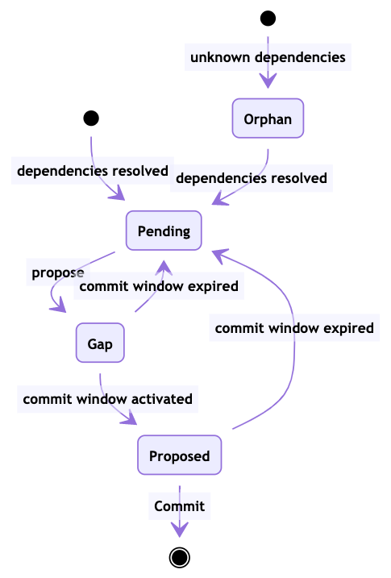
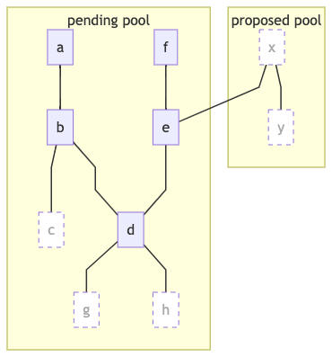

First, ckb pool has a minimum fee rate threshold. The CKB node reject transactions submitted via RPC and relayed via P2P network which fee rate is under the threshold.

The transaction fee rate is computed by dividing the fee with the serialized transaction size. The threshold can be configured in `ckb.toml` as the option `tx_pool.min_fee_rate`, which unit is `Shannons per 1,000 bytes`. The default threshold is 1,000 Shannons per 1,000 bytes.

Since the threshold rejects relayed transactions, submitting a transaction with lower fee rate must ensure there's a path routed to a miner node, and all the nodes along the path have changed the threshold to a lower value.

The CKB transactions pool indeed contains 4 collections:

* The orphan pool saves transactions which has at least one input or dep cell that refers to a transaction not in the chain nor the other 3 pools.
* The pending pool constitutes transactions which are not proposed yet.
* The gap pool contains transactions which have been proposed but are not ready to be committed yet.
* The proposed pool stores transactions which are ready to be commit into the next block.



When CKB creates a block template, it proposes transactions from the  pending pool and commit transactions from the proposed pool.

The transactions in the pending pool and proposed pool are sorted by score, and transactions with higher score are picked first. The score is computed by

```
min(
  transaction fee / transaction vbytes,
  ancestors and self fee / ancestors and self vbytes
)
```

The transaction fee is straightforward.

The transaction vbytes is computed as:

```
max(
  serialized size,
  consumed cycles * 17 / 100000
)
```

The ancestors and self is defined in a recursive way. It is denoted as *package* below to simplify the definition.

**Definition**: The package of a transaction includes itself and the packages of all its dependent transactions which are in the same pool. The dependent transactions are the all transactions which any of the input and dep cell refers to.

The following diagram shows ancestors and self of the transaction *d*.



---

## Appendix

The diagrams are generated using [Mermaid](https://mermaid-js.github.io/mermaid-live-editor/).

### CKB Pool State Diagram


[SVG version](ckb-pool-state-diagram.svg)

```
stateDiagram
  %% CKB Pool State Diagram
  [*] --> Orphan : unknown dependencies
  [*] --> Pending : dependencies resolved
  Orphan --> Pending : dependencies resolved
  Pending --> Gap : propose
  Gap --> Pending : commit window expired
  Gap --> Proposed : commit window activated
  Proposed --> Pending : commit window expired
  Proposed --> [*] : Commit
```

### CKB Ancestors and Self Package

[SVG version](ckb-tx-ancestors-and-self.svg)

```
graph TD
  %% CKB Ancestors and Self Package
  classDef faded fill:white,stroke-dasharray: 5, 5,color:#aaa
  subgraph proposed pool
    x:::faded --- y:::faded
  end
  subgraph pending pool
    a --- b
    b --- c:::faded
    b --- d
    e --- d
    x --- e
    f --- e
    d --- g:::faded
    d --- h:::faded
  end 
```
