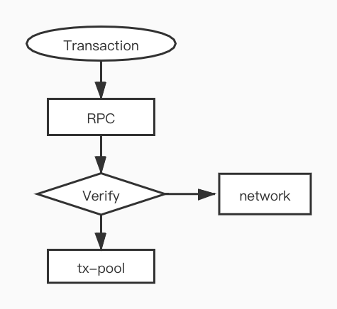
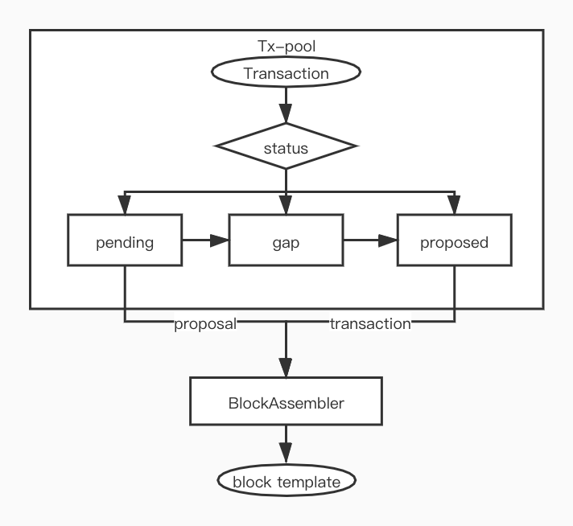

交易是与 Nervos CKB 交互最基本的对象。当你与 CKB 交互时，你是在通过交易进行提交交易状态。本章节将介绍 CKB 交易验证的声明周期。



##  通过 RPC 提交交易

首先，发送者会构建交易，然后通过 RPC 进行提交。交易将由已经提交的 `outputs_validator`（在 v0.27.0 中引入）进行验证。

默认的验证逻辑包括检查多个方面：

```
transaction.outputs.all{ |output|
    let script = output.script
    (script.code_hash == secp256k1_blake160_sighash_all && script.hash_type == "type" && script.args.size == 20) ||
    (script.code_hash == secp256k1_blake160_multisig_all && script.hash_type == "type" && （script.args.size == 20 || (script.args.size == 28 && script.args[20..28].is_valid_since_format))
}
transaction.outputs.all{ |output|
    let script = output.type
    script.is_null || script.code_hash == dao && script.hash_type == "type"
    || (script.has_lock_period() && since.is_absolute())
}
```

这种验证的目的是为了防止不适当地构建交易，例如该常见问题汇总中所提及的： *https://github.com/nervosnetwork/ckb/wiki/Common-Gotchas#nervos-dao* 

虽然节点可以配置 `passthrough` 以跳过这种验证，但一旦交易被提交到你的本地节点，节点也会导出交易id，然后可以用来跟踪交易状态。

## 验证

在交易被广播进入内存池之前，应该在本地进行验证和执行。

### 步骤一：解析

本质上，交易的输入就是指针，如这里所示：

```
struct OutPoint {
    tx_hash:        Byte32,
    index:          Uint32,
}
```

在交易执行之前，我们通过指针收集引用的数据，这个过程叫做 “解析交易”。我们还需要检查这笔交易的所有输入是否有效（没有重复或双花）。

### 步骤二：验证

验证过程包括检查以下项目：       

1. 版本（当前必须为 0） 
2. serialized_size 小于限制值
    1. pub fn serialized_size(&self) -> usize {
            // the offset in TransactionVec header is u32
            self.as_slice().len() + molecule::NUMBER_SIZE
            // molecule::NUMBER_SIZE = `size_of::<u32>() 4`
        }
3. 输入非空
    1. inputs().is_empty() || outputs().is_empty()
4. 输入已到期
    1. 对于每个输入和 dep，如果引用的交易输出是 cellbase，则其必须至少得有 4 epoch 的确认。
5. 容量
    1. （这里有误？）sum of inputs’ capacity must less than or equal to outputs’ capacity输入容量之和必须大于等于输出容量之和
6. duplicate_deps
    1. deps 不可重复
7. outputs_data_verifier
    1.  ‘output data' 字段的数量必须等于输出的数量
8. since     
    1. ‘since’ 值必须符合该规则：https://github.com/nervosnetwork/rfcs/blob/master/rfcs/0017-tx-valid-since/0017-tx-valid-since.md

然后 CKB VM 会执行交易脚本和并输出消耗的周期（Cycle）数。

## 向网络广播交易

如果验证成功，当前节点将交易（含 Cycle 值）广播给其所有连接的节点。

如果验证失败，交易便不向外广播。 交易流经各个 “全节点”，这些节点重复上一步所述的验证过程，并检查周期值（Cycle）是否与交易验证时实际消耗的周期相符。

## 交易池（内存池）



CKB 的交易确认分为两步，交易在交易池中会分为准备中（pending）和已提交（proposed）两种不同状态。当链上有新区块加入时，交易的状态就会改变。当最新的区块变化时，交易池中的所有交易将被重新扫描，以确保它们仍然有效。

`BlockAssembler` 会为区块模板从两个状态交易池中获取对应状态的交易。

关于交易确认流程的两个步骤，可以参考一下链接了解更多：

https://github.com/nervoscommunity/docs/blob/master/docs/rfcs/0020-ckb-consensus-protocol/0020-ckb-consensus-protocol.zh.md#%E4%B8%A4%E6%AD%A5%E4%BA%A4%E6%98%93%E7%A1%AE%E8%AE%A4

