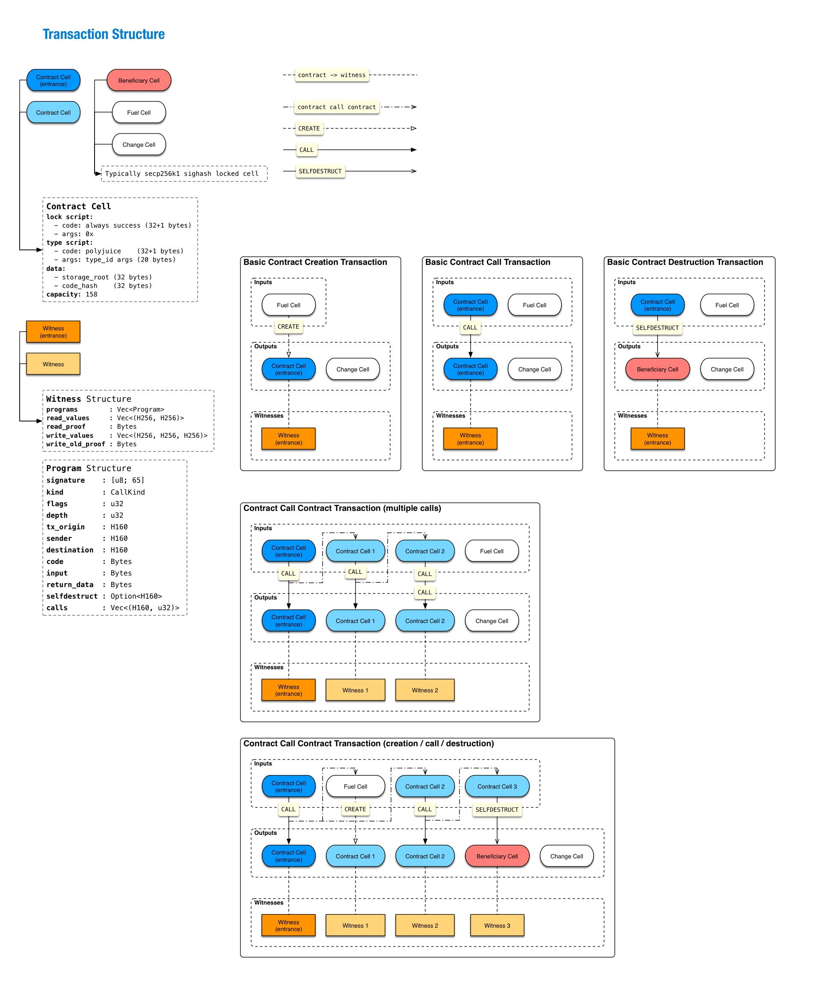
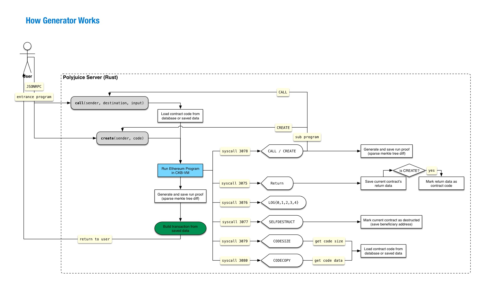

[Polyjuice](https://github.com/nervosnetwork/polyjuice) is an Ethereum compatible layer and has implemented most of the functions of Ethereum on CKB, including running an EVM contract on CKB-VM. We believe that we have achieved full-featured compatibility with the implementation of EVM,which is also the power of CKB-VM.By polyjuice we want to showcase that it is perfectly possible to use account model on Nervos CKB. The flexibility here actually enables countless opportunities.

## Basic Concepts

### Account 

There are two kinds of accounts, contract account, and EoA account.

**Contract Account**

 The contract account in Polyjuice is a cell constrained by Polyjuice type script. The type script args is a [`type_id`](https://github.com/nervosnetwork/rfcs/blob/master/rfcs/0022-transaction-structure/0022-transaction-structure.md#type-id) value so that the type script is unique. The first 32 bytes of the cell data is the `storage root` (sparse-merkle-tree) of the contract. The second 32 bytes of the cell data is the `code_hash` (`blake2b(code)`) of the contract. Since we want everyone to use the contract, we default the use of an always success lock script. We can also use any lock script for access control or other purposes.

**EoA Account**

The EoA account in Polyjuice is all live cells locked by default secp256k1 sighash lock script. The id of the account is the lock script args.


### Contract

A contract in Polyjuice is mostly the same as an ethereum contract. You can write your contract in Solidity, Vyper, or Assembly, then compile to EVM byte code. There are some minor differences. Since it's **impossible** to read block information from the current block, we instead read block information from the most recent block. The most recent means the latest block of blocks includes the transaction inputs:


```
max(block_number(inputs))
```

It will effect following op codes:

- `BLOCKHASH` 
- `COINBASE` 
- `TIMESTAMP`
- `NUMBER`
- `DIFFICULTY`
- `GASLIMIT`

The `DIFFICULTY` value is the difficulty of [Nervos CKB chain](https://github.com/nervosnetwork/rfcs/blob/master/rfcs/0020-ckb-consensus-protocol/0020-ckb-consensus-protocol.md#dynamic-difficulty-adjustment-mechanism). The `GASLIMIT` here is a constant value, which equals the max value of `int64_t `(9223372036854775807). The transaction cost is determined by its size and [cycles](https://github.com/nervosnetwork/rfcs/blob/master/rfcs/0014-vm-cycle-limits/0014-vm-cycle-limits.md), so gas limit is meaningless in Polyjuice.

 The `COINBASE` return value and `SELFDESTRUCT` beneficiary address are the first 20 bytes of lock script hash, which is:

```
blake2b(lock_script)[0..20]
```

### Program

A program is a `CREATE` or `CALL` with parameters. Since polyjuice supports contract call contract, a polyjuice transaction can contain multiple programs, which will be serialized and put into witness.

### Generator

Polyjuice generator can generate a Polyjuice transaction through JSONRPC API as below:

```
fn create(sender: H160, code: Bytes) -> TransactionReceipt;
fn call(sender: H160, contract_address: H160, input: Bytes) -> TransactionReceipt;
```

### Validator

Polyjuice validator is the type script that verifies the transformation of contract cells.

### Indexer

Indexer is a Polyjuice module for indexing every Polyjuice transaction in CKB block. The contract metadata, alteration, and all the logs emitted from the Polyjuice transaction will be saved. Also, all live cells will be indexed for running the generator (build Polyjuice transaction).

## Design Details

### How to organize cells in a CKB transaction?



If the picture is not clear, please click：
 **[Organize cells in a CKB transaction](https://github.com/TheWaWaR/polyjuice/blob/docs/docs/assets/polyjuice-transaction-structure.pdf)**

### The CKB transaction generation process



If the picture is not clear, please click：
**[CKB transaction generation process](https://github.com/TheWaWaR/polyjuice/blob/docs/docs/assets/polyjuice-how-generator-works.pdf)**

### The CKB transaction validation process


If the picture is not clear, please click：
 **[CKB transaction validation process](https://github.com/TheWaWaR/polyjuice/blob/docs/docs/assets/polyjuice-how-validator-works.pdf)**

### Communicate through ckb-vm syscalls

In Generator and Indexer, we use syscalls to handle the event emitted from the program execution process. The syscalls we currently used are shown below:

- 2177 is for ckb_debug, useful when you want to debug the generator.
- 3075 is for returning the EVM result.
- 3076 is for logging.
- 3077 is for saving `SELFDESTRUCT` beneficiary address.
- 3078 is for handle CALL and CREATE opcodes.
- 3079 is for returning code size of a contract to EVM.
- 3080 is for returning a coded slice of a contract to EVM.

## Implementation Details

### How to handle contract creation?

A `CREATE` from a sender (EoA account) or contract will lead to contract creation. In generator,  the created cell will be assigned a type_id type script, and the contract code hash will be saved in the data field next to the account storage root hash. In validator, type script will check the contract code hash match the code_hash in the data field.

### How to handle contract destruction?

Contract destruction only happens when a `SELFDESTRUCT` opcode is executed. In the generator, the destructed contract cell is consumed as input, then put an output cell as the beneficiary cell, and the beneficiary address is the corresponding secp256k1 sighash lock script.

### How to generate a contract call contract CKB transaction?

When CALL or CREATE opcode is invoked in EVM, we call it a contract call contract transaction. When invoking CALL opcode, generator load contract code and latest storage from the database or saved state (the contract has already been loaded from database) by destination and execute it. When CREATE opcode executed after EVM started, the generator will put an output cell just like how contract creation works.

### How to validate contract call contract CKB transaction?

The first contract created or called by EoA account we call it **entrance** contract, other contracts if there is any, we call them normal contracts. Only one program is allowed in **the entrance** contract, and all its calls to normal contracts' programs must match the order and count. All normal contracts' calls to sub normal contracts' programs must check they match the request. Since multiple contracts may call one contract, the count can not be checked by a normal contract. Normal contracts only check their own programs, and **the entrance** contract will check all programs in current CKB transaction that are being called with the restricted sequence.

### How to verify the contract sender (EoA account)?

Since EVM execution will use the sender information, we require the sender to sign the Polyjuice transaction and put the signature into witness. The sign content must include two parts:

1. transaction hash  
2. all contracts' related witnesses 

The contract-related witness is serialized as part of the `WitnessArgs` molecule structure, and the information is located in input_type (contract call/destruction) field or output_type (contract creation) field.

### How to handle logs?

In validator, the logs are just being ignored. When the generator generates the Polyjuice transaction, the logs are saved and returned as part of the transaction receipt. When the Indexer processes the Polyjuice transaction, the logs are saved to the database for users to query.

 In generator and Indexer the logs are trigged by LOG opcode, then:

1. callback function `emit_log` is called
2. emit_log invoke a log syscall with topics and data as arguments
3. Rust syscall handler function is called, the arguments been extracted and saved